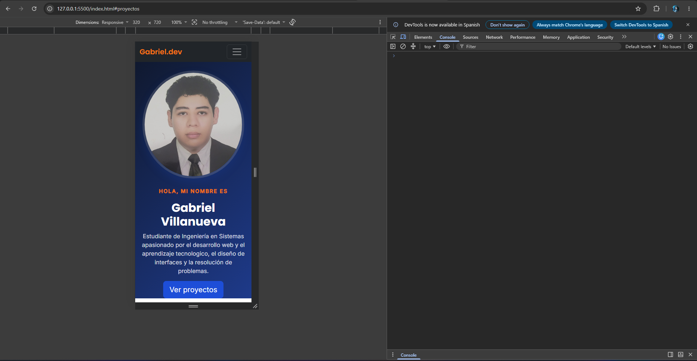
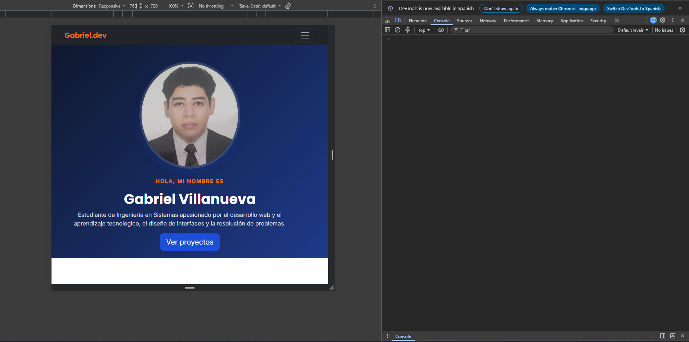
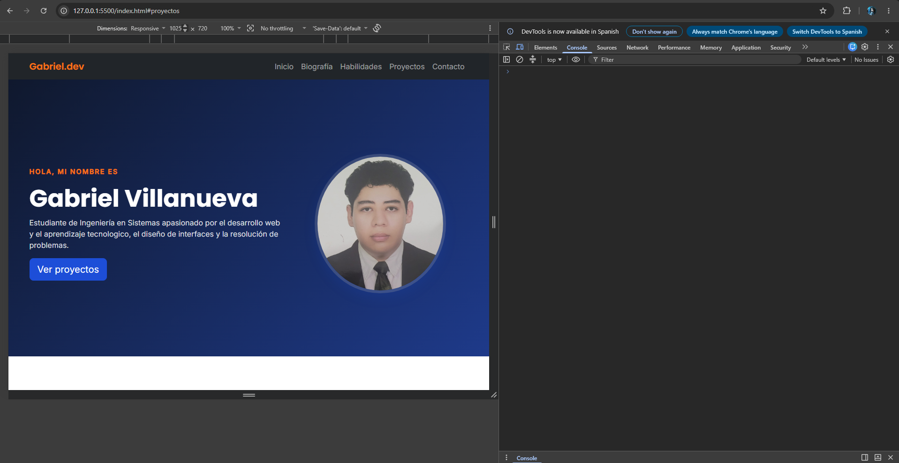

# Portafolio Personal — Gabriel Villanueva

## Objetivo del proyecto

Página web de presentación personal desarrollada como práctica de HTML5 semántico,
diseño responsive y personalización con CSS sobre el framework Bootstrap 5.
El objetivo es aprender a integrar un framework CSS moderno sin perder identidad
visual propia, aplicando los conceptos vistos en clase.

## Cómo ejecutar la página

1. Clona este repositorio o descarga el ZIP.
2. Abre el archivo `index.html` directamente en cualquier navegador
   (doble clic, o clic derecho → "Abrir con" → tu navegador).
3. No requiere instalación de dependencias ni servidor local, ya que Bootstrap
   se carga mediante CDN.

Opcional: si usas VS Code, puedes abrirlo con la extensión "Live Server" para
recarga automática mientras editas.

## Componentes de Bootstrap utilizados

- **Navbar** (`navbar`, `navbar-expand-lg`, `navbar-toggler`): barra de navegación
  responsive que colapsa en un menú hamburguesa en pantallas pequeñas.
- **Grid system** (`container`, `row`, `col-12`, `col-md-6`, `col-lg-4`, etc.):
  estructura todas las secciones de forma responsive.
- **List Group** (`list-group`, `list-group-item`): usado en la sección de
  habilidades técnicas y en la visión profesional.
- **Badges / Rounded Pills** (`badge`, `rounded-pill`): usados para mostrar
  niveles de habilidad e intereses.
- **Cards** (`card`, `card-img-top`, `card-body`): usadas para mostrar los
  3 proyectos/pasatiempos.
- **Utilidades de Flexbox** (`d-flex`, `align-items-center`,
  `justify-content-between`, `gap-2`): usadas para alinear elementos dentro
  de componentes.

## Personalización mediante CSS (`css/style.css`)

- Variables de color propias (`--color-primary`, `--color-accent`) con una
  paleta de azul y naranja complementario.
- Tipografías personalizadas de Google Fonts: Poppins para títulos, Inter
  para texto general.
- Fondo degradado (`linear-gradient`) en el encabezado.
- Sombras propias (`box-shadow`) en tarjetas e imagen de perfil.
- Animaciones/transiciones suaves: las cards "flotan" al pasar el mouse
  (`transform: translateY`), la foto de perfil crece levemente al hacer hover.
- Ajustes de espaciado (`padding`) por sección para mantener consistencia visual.

## Decisiones de diseño

- Se alternan fondos claros/blancos entre secciones para separar visualmente
  el contenido sin usar líneas divisorias.
- El menú de navegación usa anclas (`#inicio`, `#biografia`, etc.) para
  scroll suave dentro de la misma página.
- Se prefirió reutilizar componentes de Bootstrap ya usados (por ejemplo
  `list-group` tanto en habilidades como en visión profesional) en vez de
  crear componentes nuevos, para mantener consistencia visual y código
  más limpio.
- Todo el CSS personalizado evita el uso de `!important`, aprovechando el
  orden de carga de las hojas de estilo (Bootstrap primero, `style.css`
  después) para sobreescribir estilos por especificidad natural.

## Capturas de responsive

### 320px (móvil)

### 768px (tablet)

### 1280px (escritorio)
